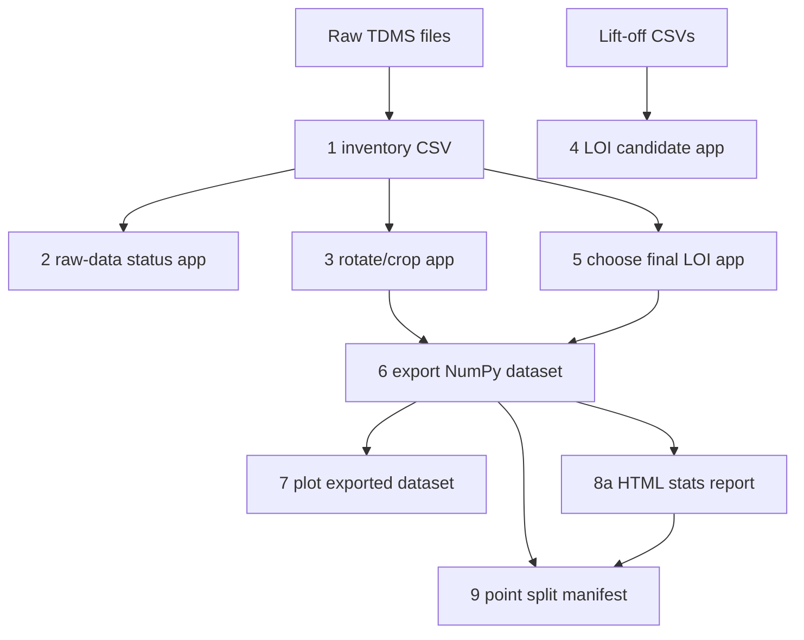

# NDT Workflow

This project has two kinds of commands:

- **Apps**: human review tools. They open Streamlit and write CSV decisions.
- **Batch commands**: non-interactive commands. They create inventories, arrays, plots, or reports.

Use this page as the map from raw TDMS files to trainable arrays.

## Quick Status

```bash
uv run ndt status
```

This checks the expected config files, exported datasets, and HTML report.
Legacy numbered commands are still registered for compatibility; prefer `uv run ndt ...` for new work.

## Pipeline

| Stage | Goal | Command | Main Input | Main Output |
|---|---|---|---|---|
| 1 | Create raw inventory | `uv run ndt inventory create` | `~/Documents/NDT-data/**/*.tdms` | `configs/raw_tdms_inventory.csv` |
| 2 | Audit raw data | `uv run ndt raw status` | inventory + review CSVs | Streamlit dashboard |
| 3 | Review spatial alignment | `uv run ndt preprocess review` | raw TDMS + inventory | `configs/raw_tdms_rotate_crop.csv` |
| 4 | Review LOI candidates | `uv run ndt loi review` | `~/Documents/Lift-off/*.csv` | `configs/loi_windows.csv` |
| 5 | Choose final LOI | `uv run ndt loi choose` | TDMS + LOI candidates | `configs/selected_loi_windows.csv` |
| 6 | Build dataset arrays | `uv run ndt export tdms` | TDMS + review configs | `outputs/tdms_npy/<export>/X.npy`, `y.npy`, `meta.json` |
| 7 | Inspect dataset arrays | `uv run ndt plot tdms` | exported `.npy` files | PNG plots beside export |
| 8a | Summarize exports | `uv run ndt export stats` | `outputs/tdms_npy` | `outputs/report-tdms-npy-stats.html` |
| 8b | Summarize inventory | `uv run ndt export dataset-summary` | `configs/raw_tdms_inventory.csv` | `outputs/report-dataset-summary.html` |
| 8c | View specimen masks | `uv run ndt export mask-viewer` | `configs/specimen_mask_features.json` | `outputs/viewer-mask.html` |
| 9 | Create grouped point splits | `uv run ndt split points` | `outputs/tdms_npy` | `outputs/point_splits/ndt-point-split-v1/README.md` |
| 10 | Train point classifier | `uv run ndt train point-classification` | grouped point split + `X.npy` | `outputs/point_training/<seed>/<protocol>/<dataset>/<label-mode>/<model>/<balance-mode>/` |

## Dependency Shape



## Common Paths

| Path | Meaning |
|---|---|
| `configs/raw_tdms_inventory.csv` | Raw TDMS file list and inferred metadata |
| `configs/raw_tdms_rotate_crop.csv` | Human-reviewed rotation, flip, and crop settings |
| `configs/loi_windows.csv` | Candidate lift-off interval windows |
| `configs/selected_loi_windows.csv` | Final chosen LOI windows |
| `outputs/tdms_npy/` | Exported ML-ready arrays |
| `outputs/point_splits/ndt-point-split-v1/README.md` | Index of grouped point-level train/val/test manifests |
| `outputs/report-tdms-npy-stats.html` | Dataset-level HTML report |
| `outputs/report-dataset-summary.html` | Inventory-derived grouped TDMS file counts |
| `outputs/viewer-mask.html` | Browser viewer for corrosion/rivet/mixed mask definitions |

## Recommended Order

```bash
uv run ndt status
uv run ndt inventory create
uv run ndt raw status
uv run ndt preprocess review
uv run ndt loi review
uv run ndt loi choose
uv run ndt export tdms
uv run ndt plot tdms
uv run ndt export stats
uv run ndt split points
uv run ndt train point-classification --protocol same_lift_off --dataset z1 --model cnn1d --balance-mode class_weight
# Valid models: cnn1d, resnet1d, inception_time, tcn, mlp, logreg, random_forest
```

See `docs/split_protocol.md` before training.
