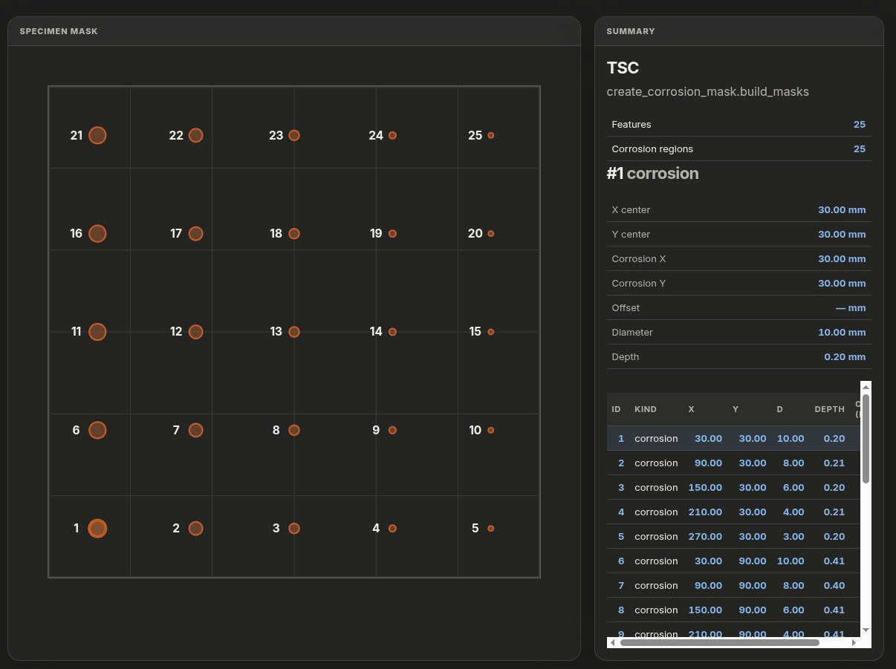
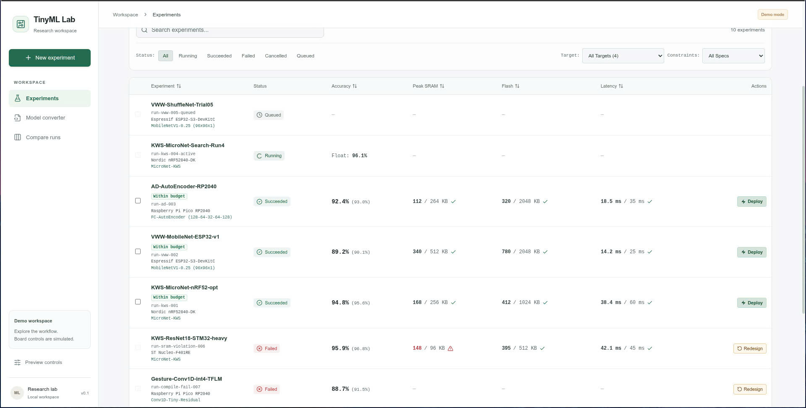

# Lab update — 2026-10-03

## Meeting

- Date: 2026-10-03
- Week / session: 2026-W40 / meeting-1
- Presenter: Le Tien Dat
- Affiliation: ICSLab

## Team progress

Source: Work statuses reported by Đạt; not independently verified.

| Member | Reported status |
| --- | --- |
| Ngọc | Studying deep learning and its application to IMU sensors with quantum-computing algorithms. |
| Ninh | Studying complex-number foundations; reports understanding qubits, superposition, and multi-qubit circuits; analyzing superdense coding. |
| Khoa | Studying agentic methods combined with quantum-computing algorithms. |
| Hưng | No study yet. |
| Sâm | No study yet. |
| Long | Studying quantum-computing algorithms; reports understanding complex-number foundations, qubits, superposition, and qubit circuits; combining this work with agentic coding. |
| Hòa | Working on version 2 related to the paper (scope unspecified); implementing real-time fall detection; re-collecting data because of noise. |

## Đạt's work status

| Work | Status | Description |
| --- | --- | --- |
| Labeling update and model retraining | In progress; retraining currently running | Updating labels for the TSC specimen and rounding numerical values to two decimal places. |
| End-to-end framework, including a web app | In progress | Developing an integrated framework and its web app. |

### TSC labeling interface

The supplied screenshot shows 25 numbered corrosion regions on the TSC specimen. The interface displays region coordinates, diameter, and depth in millimeters, with numerical values formatted to two decimal places. This illustrates the labeling update, not retraining progress or model performance.

### Framework web app

The supplied screenshot shows the TinyML Lab Experiments page, status and target filters, experiment metrics, and navigation to Model converter and Compare runs. The app is in demo mode with simulated board controls; displayed runs and metrics are not reported experimental results or evidence of a completed end-to-end pipeline.

Image source: Screenshots supplied by Đạt. Original artifact and run IDs were not supplied.
